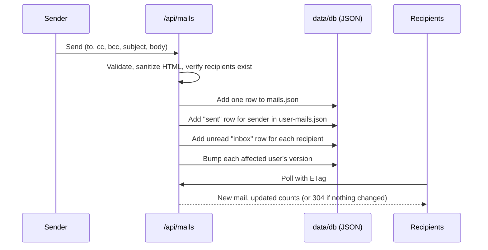

<div align="center">

# ⚡ NorthStar.co

**A private, role-based internal email system for company employees.**

Send, receive, organize, and search mail inside your organization. No external providers, no public sign-ups.


</div>
---

## Table of Contents

1. [Screenshots](#screenshots)
2. [Problem Statement](#problem-statement)
3. [What It Solves](#what-it-solves)
4. [Features](#features)
5. [How It Works](#how-it-works)
6. [Tech Stack](#tech-stack)
7. [Folder Structure](#folder-structure)
8. [Data Model](#data-model)
9. [Getting Started](#getting-started)
10. [Demo Accounts](#demo-accounts)
11. [Known Limitations](#known-limitations)
12. [Roadmap](#roadmap)
13. [Author](#author)

---

## Screenshots

### Inbox with filters

One **Filters** button holds every filter (unread, starred, attachment, category, sender, date range, sort). Search sits in the header.


### Threaded mail view

Opening a mail shows the full conversation with reply, reply all, forward, star, and delete actions.


### Collapsed sidebar

The sidebar collapses to an icon rail, and unread counts show as badges on the icons.


### Admin: user management

Admins create accounts, assign roles, and activate or deactivate users. There is no public sign-up.


---

## Problem Statement

Companies communicate internally over a patchwork of public email providers, chat apps, and shared documents. This creates real problems:

- **Company data leaves the company.** Internal conversations live on third-party servers the organization does not control.
- **No structure or ownership.** Personal and work mail are mixed together, and IT cannot manage who has access to what.
- **Noise and lost context.** Announcements, approvals, and discussions get buried across tools, with no threading, categories, or reliable search.
- **No visibility.** There is no single place to see how communication flows across teams, or to manage users and roles centrally.
- **Heavy tooling for a simple need.** Full enterprise suites are costly and complex when a team only needs a fast, private internal mailbox.

## What It Solves

NorthStar.co gives an organization its own closed mail system:

| Problem | How NorthStar.co addresses it |
| --- | --- |
| Data leaves the company | Mail is stored and served by the company's own app. Only registered employees can send or receive |
| Anyone can sign up | Public registration is disabled. **Admins create every account** |
| No access control | Role-based access (admin, manager, hr, employee) enforced in the API, not just the UI |
| Mail is hard to organize | Inbox, Starred, Snoozed, Sent, Drafts, All mail, Trash, Spam, plus categories, threads, and filters |
| One person's action affects others | Read, star, delete, and spam state is stored **per user**, so each mailbox is independent |
| Hard to find things | Server-side search and filters by sender, category, date, unread, and starred |
| No overview | A dashboard computed live from real data, with widgets that depend on the user's role |
| Slow, flickering UIs | Cached queries, ETag polling, and rate limiting keep the app fast and stable |

## Features

- **Authentication:** JWT in an httpOnly cookie, bcrypt password hashing, route protection via middleware
- **Admin-managed accounts:** create, deactivate, and change roles from an admin page; forced password change on first login
- **Mailbox:** compose with a rich-text editor (To, Cc, Bcc, subject, body), auto-saved drafts, reply, reply all, forward, threaded conversations
- **Organization:** read/unread, star, important, snooze, archive, spam, trash and restore, categories, bulk actions
- **Search and filters:** one Filters button covering unread, starred, category, sender, date range, and sort; all applied on the server and kept in the URL
- **Dashboard:** live counts, mail per category, mail per day, top senders, recent mail; admins also see user and system totals
- **Settings that apply instantly:** theme (light, dark, system), density, default folder, rows per page, refresh interval, notifications, signature, sidebar state
- **Profile:** edit details, avatar, and password; delete account with confirmation
- **UI:** collapsible sidebar, fixed header and sidebar with scrolling only inside the main area, responsive layout
- **Performance and safety:** Redis caching, sliding-window rate limits, server-side HTML sanitization, security headers

## How It Works

### 1. Authentication and access

1. A user logs in with email and password. The server verifies the bcrypt hash and sets a signed JWT in an httpOnly cookie.
2. `middleware.ts` verifies the token on every request. Unauthenticated page requests redirect to `/login`, and unauthenticated API requests return `401`.
3. Route handlers check the user's role (`requireRole`) for admin-only actions. Users can only ever read mail that they sent or received.
4. `/signup` is an information page only. The signup API is closed, and admins create accounts.

### 2. Sending and receiving mail

Message content is stored **once**. Each person's view of it is a separate row.



- `mails.json` holds the message (subject, body, thread, sender, recipients).
- `user-mails.json` holds each user's own state for that message: folder, read, starred, important, category, snoozed-until.
- Bcc addresses are never exposed to other recipients.

### 3. Keeping the UI fast and stable

- Every write bumps a per-user **version number**, used as the response `ETag`. The client polls with `If-None-Match` and the server answers `304` when nothing changed, so idle polling causes no re-render or flicker.
- List queries, counts, dashboard stats, and user search are cached in Redis with short TTLs. Cache keys include the user's version, so writes invalidate automatically.
- If Redis is unavailable, the app falls back to an in-memory store and keeps working.

### 4. Rate limiting

| Action | Limit |
| --- | --- |
| Login | 5 per minute per IP |
| Send mail | 20 per minute per user |
| List and search | 120 per minute per user |
| Other writes | 60 per minute per user |

Exceeding a limit returns `429` with `Retry-After` headers, and the UI shows a toast and disables the action until it can be retried.

### 5. Roles

| Role | Can do |
| --- | --- |
| `admin` | Everything: manage users and roles, edit global dashboard defaults, view system stats |
| `manager` | Send to all, view team stats |
| `hr` | Send company-wide announcements |
| `employee` | Send and receive mail, manage own settings |

### 6. Dashboard and settings

Dashboard numbers are computed from the JSON files on each request for the current user. Settings are stored per user and fall back to global defaults in `dashboard-settings.json`. Changes to theme, density, and other options apply immediately and persist across reloads.

## Tech Stack

| Layer | Technology |
| --- | --- |
| Framework | Next.js (App Router) with TypeScript |
| Styling and UI | Tailwind CSS, shadcn/ui, lucide-react, next-themes |
| Editor | Tiptap (rich-text mail body) |
| Charts | Recharts |
| Client data fetching | TanStack Query (caching, optimistic updates, ETag polling) |
| API | Next.js Route Handlers (Node.js runtime) |
| Auth | JWT (`jose`) in httpOnly cookie, `bcryptjs` |
| Validation | Zod (client and server) |
| Sanitization | `sanitize-html` for mail bodies |
| Storage | JSON files in `data/db/` behind a typed data layer |
| Cache and rate limiting | Upstash Redis (`@upstash/redis`, `@upstash/ratelimit`) with in-memory fallback |
| Architecture | Layered: route handlers, services, data layer |

## Folder Structure

```
northstar/
├── app/
│   ├── (app)/                        # Authenticated shell (header + sidebar + main)
│   │   ├── layout.tsx
│   │   ├── mail/
│   │   │   └── [folder]/
│   │   │       ├── page.tsx          # Mail list
│   │   │       └── [mailId]/
│   │   │           └── page.tsx      # Mail detail and thread
│   │   ├── dashboard/page.tsx
│   │   ├── profile/page.tsx
│   │   ├── settings/page.tsx
│   │   └── admin/
│   │       └── users/page.tsx        # Admin user management
│   ├── login/page.tsx
│   ├── signup/page.tsx               # Info page: accounts are created by admins
│   ├── api/
│   │   ├── auth/                     # login, logout, me
│   │   ├── mails/                    # list, detail, send, draft, actions, bulk, counts
│   │   ├── users/                    # search, admin management
│   │   ├── settings/me/
│   │   ├── profile/me/
│   │   ├── dashboard/
│   │   └── health/
│   ├── layout.tsx
│   └── globals.css
├── components/
│   ├── ui/                           # shadcn/ui primitives
│   ├── layout/                       # Header, Sidebar, PageHeader
│   ├── mail/                         # MailList, MailRow, ReadingPane, Compose, Filters
│   └── dashboard/                    # Widgets and charts
├── lib/
│   ├── db/                           # Typed JSON data layer (atomic writes + mutex)
│   ├── auth/                         # jwt.ts, session.ts
│   ├── redis.ts                      # Upstash client with in-memory fallback
│   ├── rate-limit.ts
│   └── validators/                   # Zod schemas
├── data/
│   └── db/                           # JSON "database" (committed with default data)
│       ├── users.json
│       ├── roles.json
│       ├── user-roles.json
│       ├── mails.json
│       ├── user-mails.json
│       ├── mail-categories.json
│       ├── dashboard-settings.json
│       ├── user-dashboard-settings.json
│       └── versions.json             # Per-user version used for ETag and cache keys
├── docs/
│   └── screenshots/                  # Images used in this README
├── hooks/
├── types/
├── middleware.ts                     # JWT check (Edge-safe, uses jose only)
├── package.json
└── README.md
```

> All reads and writes to `data/db/` go through `lib/db/` only. Writes are atomic (temp file, then rename) and guarded by a mutex, so concurrent requests cannot corrupt a file.

## Data Model

| File | Purpose |
| --- | --- |
| `users.json` | User identity, profile (job title, department, avatar), password hash, status, and timestamps |
| `roles.json` | Role identifiers and names |
| `user-roles.json` | User-to-role assignments |
| `mails.json` | Canonical message content, stored once: sender, to/cc/bcc, thread, subject, body, draft flag, and timestamps |
| `user-mails.json` | Per-user state of a mail: folder, read/starred flags, category, snooze, and deletion state |
| `mail-categories.json` | Category identifiers and display names (for example Product, Design, HR, Finance, Personal, Work) |
| `user-dashboard-settings.json` | Per-user dashboard preferences and enabled widgets (theme, density, default folder, signature, sidebar state) |
| `dashboard-settings.json` | Admin-managed global defaults |
| `versions.json` | Per-user cache invalidation versions, used for ETags and cache keys |

## Getting Started

### Prerequisites

- Node.js 18.18 or newer
- npm, pnpm, or yarn
- (Optional) An Upstash Redis database for caching and rate limiting

### Installation

```bash
git clone https://github.com/<your-username>/northstar.git
cd northstar
npm install
```

### Environment variables

| Variable | Required | Purpose |
| --- | --- | --- |
| `JWT_SECRET` | Yes | Strong secret used to sign sessions |
| `UPSTASH_REDIS_REST_URL`, `UPSTASH_REDIS_REST_TOKEN` | No | Redis cache and rate limiting credentials. Falls back to in-memory if missing |
| `KV_REST_API_URL`, `KV_REST_API_TOKEN` | No | Vercel KV-compatible alternative to the Upstash variables |
| `NEXT_PUBLIC_DEV_SUPABASE_REDIRECT_URL` | No | Preview redirect configuration, used only when present |

Create a `.env.local` file:

```env
# Required: long random string used to sign JWTs
JWT_SECRET=change-me-to-a-long-random-string

# Optional: Redis cache and rate limiting (Upstash)
UPSTASH_REDIS_REST_URL=
UPSTASH_REDIS_REST_TOKEN=

# Optional: Vercel KV-compatible alternative
# KV_REST_API_URL=
# KV_REST_API_TOKEN=
```

### Run

```bash
npm run dev      # development
npm run build    # production build
npm start        # run the production build
```

Open [http://localhost:3000](http://localhost:3000) and sign in with a demo account below. No seed step is needed: the default data is already in `data/db/`.

## Demo Accounts

All demo accounts use the password **`Password@123`**.

| Name | Email | Role |
| --- | --- | --- |
| Jordan Smith | jordan@northstar.co | admin |
| Maya Chen | maya@northstar.co | manager |
| Finance Team | finance@northstar.co | manager |
| People Operations | people@northstar.co | hr |
| Nora Patel | nora@northstar.co | employee |
| Andre Williams | andre@northstar.co | employee |
| Eli Brooks | eli@northstar.co | employee |

> These accounts are seeded in the local JSON files. Do not use these credentials in production; replace them with managed users before deployment.

## Known Limitations

- **JSON storage needs a writable, persistent filesystem.** It works locally and on a VPS or container host. On serverless platforms such as Vercel the project files are read-only in production, so writes (sending mail, settings, new users) will not persist. The JSON files are read and written through `lib/db` only, so all storage stays behind that layer and can be swapped for a database without touching the rest of the app.
- Mail is internal only. There is no SMTP or external email delivery.
- Live updates use ETag polling rather than WebSockets or Server-Sent Events.

## Roadmap

- [ ] Replace JSON storage with a database (PostgreSQL or MongoDB) behind the same data layer
- [ ] Real-time delivery over WebSocket or Server-Sent Events
- [ ] File attachments with size and type limits
- [ ] Labels, rules, and mail forwarding rules
- [ ] Email notifications and unread digests
- [ ] Audit log for admin actions

## Author

**Sohan Rathod** · Full-stack developer

[GitHub](https://github.com/SohanR09) · [LinkedIn](https://www.linkedin.com/in/sohan-r-rathod/)

---

<div align="center">

⚡ **NorthStar.co** — keep your company's conversations in-house.

</div>
